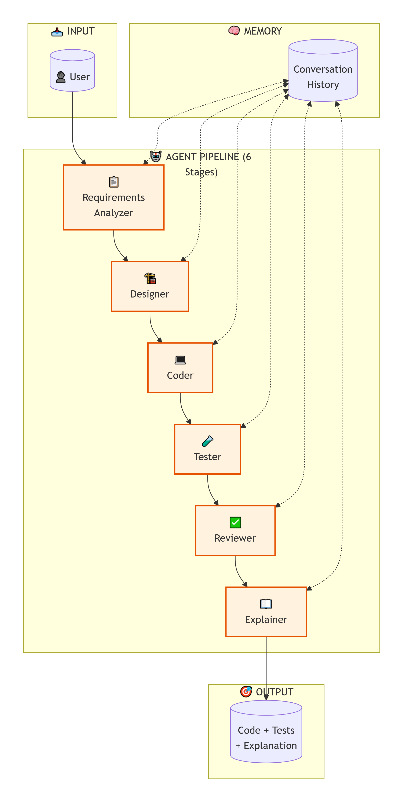
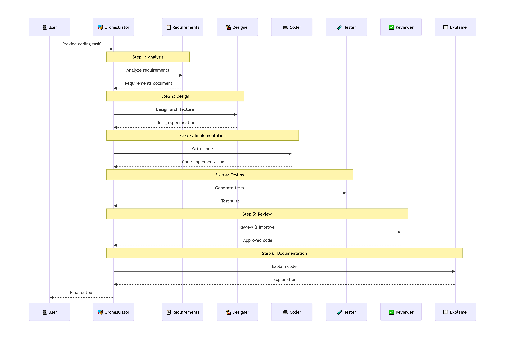
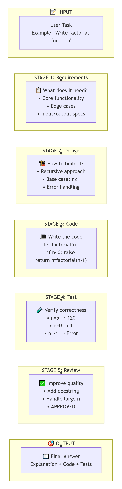
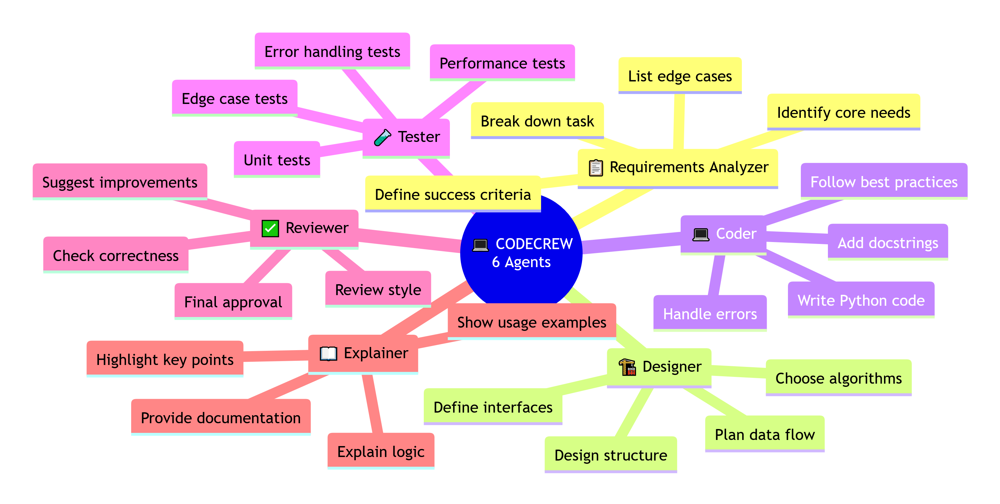

# 💻 CodeCrew

**Multi-Agent Code Generation System** - 6 specialized agents working together to write, test, review, and explain code.

[](https://python.org)
[](https://pytorch.org)

---

## 📋 Overview

**CodeCrew** is a **pure multi-agent system** (no RAG) that demonstrates how specialized agents can collaborate to generate high-quality code. Each agent has a specific role in the code generation pipeline, working together to produce complete, tested, and well-documented code.

### What it demonstrates:
- ✅ **Multi-Agent Architecture** - 6 specialized agents in a sequential pipeline
- ✅ **Code Generation** - Writes Python code from natural language descriptions
- ✅ **Test Generation** - Automatically creates test cases
- ✅ **Code Review** - Reviews and improves code quality
- ✅ **Explanation** - Provides clear, user-friendly explanations

---

## 🏗️ Architecture

### Complete System Architecture



*Figure 1: Complete CodeCrew multi-agent architecture*

### Agent Sequence Diagram



*Figure 2: Agent interaction sequence diagram*

### Simplified Pipeline



*Figure 3: Simplified view of the agent pipeline*

### Agent Roles & Responsibilities



*Figure 4: Each agent's role and responsibilities*

---

## 🤖 Agent Pipeline

| Step | Agent | Icon | Role | Output |
|------|-------|------|------|--------|
| 1 | Requirements Analyzer | 📋 | Breaks down the coding task | Clear requirements list |
| 2 | Designer | 🏗️ | Designs code architecture | Code structure + approach |
| 3 | Coder | 💻 | Writes the actual code | Complete Python code |
| 4 | Tester | 🧪 | Generates test cases | Test suite |
| 5 | Reviewer | ✅ | Reviews and improves code | Optimized code |
| 6 | Explainer | 📖 | Explains code to user | User-friendly explanation |

### Agent Details

**📋 Requirements Analyzer**
- **Input:** "Write a function to calculate factorial"
- **Output:** Core functionality, edge cases, input/output specifications

**🏗️ Designer**
- **Input:** Requirements
- **Output:** Algorithm choice, code structure, data flow

**💻 Coder**
- **Input:** Design
- **Output:** Complete Python code with docstrings and error handling

**🧪 Tester**
- **Input:** Code
- **Output:** Unit tests, edge case tests, error handling tests

**✅ Reviewer**
- **Input:** Code
- **Output:** Quality feedback, improvements, approval

**📖 Explainer**
- **Input:** Code
- **Output:** User-friendly explanation and usage examples

---

## 📦 Pre-Requisites

### 1. Downloaded Model Checkpoint
- DeepSeek Chat (7B) model (or any HuggingFace compatible LLM)
- Path: `/path/to/your/model/`

### 2. Python Dependencies
```bash
pip install torch transformers
